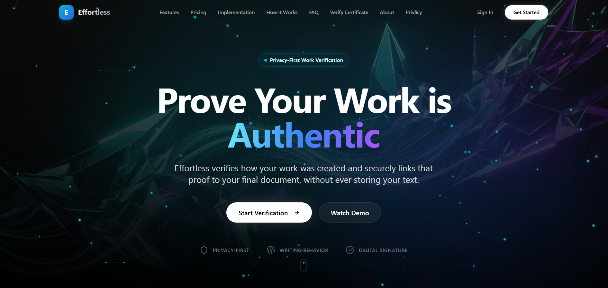
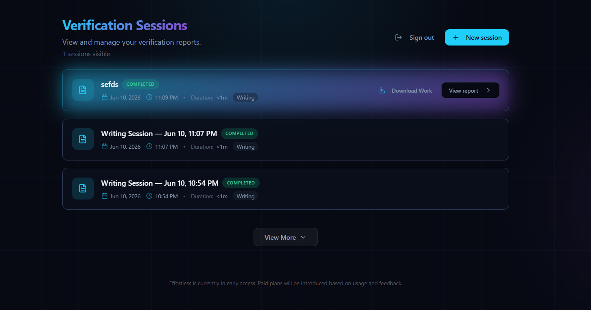
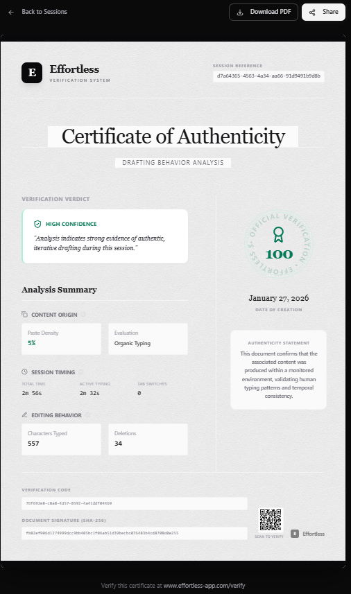
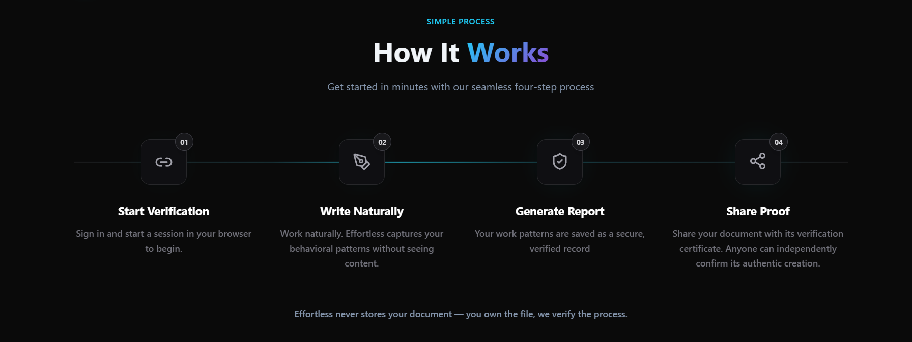

# Effortless — Proof of Human Work

**Live Demo**: [https://effortless-app.com](https://effortless-app.com)

Effortless is a project I built to explore a simple question:

How can someone prove that a piece of work was created by a person without storing or analyzing the work itself?

Instead of looking at the final document and trying to guess whether AI was used, Effortless focuses on the writing process. It creates a verification certificate that is linked to a specific document and can later be used to verify that the document was produced during a real writing session.

The platform does not store or read document content.

## Screenshots

<table width="100%">
  <tr>
    <td width="50%" align="center">
      <b>Landing Page</b><br />
      
    </td>
    <td width="50%" align="center">
      <b>Session Dashboard</b><br />
      
    </td>
  </tr>
  <tr>
    <td width="50%" align="center">
      <b>Verification Certificate</b><br />
      
    </td>
    <td width="50%" align="center">
      <b>How It Works</b><br />
      
    </td>
  </tr>
</table>

## What Problem Does This Solve?

With AI tools becoming more common, it is getting harder to know how a document was created.

Most AI detectors try to analyze the text itself and make a prediction. These systems are often unreliable and can incorrectly flag human-written work.

Effortless takes a different approach.

Instead of analyzing what was written, it focuses on how it was written.

## How It Works

A user writes inside the Effortless editor.

During the session, the application observes non-content signals such as:

* Typing patterns
* Pauses during writing
* Editing and revision behavior

The document content itself is never analyzed or stored.

When the session is finished:

1. The document is exported as a PDF.
2. A SHA-256 hash is generated from the PDF.
3. A verification certificate is created using that hash.

Anyone can later verify that:

* The document matches the certificate.
* The certificate belongs to that exact document.
* The document was created during a recorded writing session.

Effortless never stores document content.

## What Effortless Proves

* The document was created through a real writing process.
* The verification certificate is linked to a specific document.
* Any modification to the document invalidates the certificate.

## What Effortless Does Not Do

* Store document text
* Log raw keystrokes
* Capture clipboard contents
* Record screens
* Analyze writing quality or meaning
* Determine whether AI was used
* Claim originality or authorship

The goal is to provide evidence about the writing process, not to judge the content.

## Features

* Privacy-focused verification system
* Verification certificates linked to individual documents
* Writing session tracking using behavioral signals
* Independent verification without requiring an account
* Clean writing dashboard and session management tools
* Secure data access using Supabase Row Level Security (RLS)

## Tech Stack

### Frontend

* React 18 + Vite
* TypeScript
* Tailwind CSS
* shadcn/ui
* Framer Motion
* Tiptap

### State & Data

* TanStack Query
* Supabase
* React Hook Form
* Zod

### Testing & Quality

* Vitest
* Playwright
* ESLint

## Project Structure

```bash
src/
├── components/          # Reusable UI components
│   ├── ui/              # shadcn primitives
│   └── ...              # Feature-specific components
├── pages/               # Route-level pages
│   ├── Auth.tsx
│   ├── Sessions.tsx
│   ├── WritingSession.tsx
│   └── ...
├── hooks/               # Custom React hooks
├── lib/                 # Utilities and helpers
├── integrations/        # External services (Supabase)
└── App.tsx              # Application entry + routing
```

## Getting Started

### Prerequisites

* Node.js v18+
* npm, yarn, or bun

### Installation

1. Clone the repository

```bash
git clone <repository-url>
cd effortless
```

2. Install dependencies

```bash
npm install
```

### Environment Variables

Create a `.env` file:

```env
VITE_SUPABASE_URL=your_supabase_project_url
VITE_SUPABASE_ANON_KEY=your_supabase_anon_key
VITE_EMAILJS_SERVICE_ID=your_emailjs_service_id
VITE_EMAILJS_TEMPLATE_ID=your_emailjs_template_id
VITE_EMAILJS_PUBLIC_KEY=your_emailjs_public_key
```

### Run Locally

```bash
npm run dev
```

The application will start on `http://localhost:8080` (or another available port).

## Scripts

| Command         | Description                  |
| --------------- | ---------------------------- |
| npm run dev     | Start the development server |
| npm run build   | Build for production         |
| npm run preview | Preview the production build |
| npm run lint    | Run ESLint                   |
| npm test        | Run unit tests               |

## Notes

* Verification certificates are linked to a specific document.
* Any change to the document after verification will invalidate the certificate.
* Users are responsible for storing their documents and certificates.

## License

This repository is provided for demonstration and portfolio purposes.

All rights reserved.
